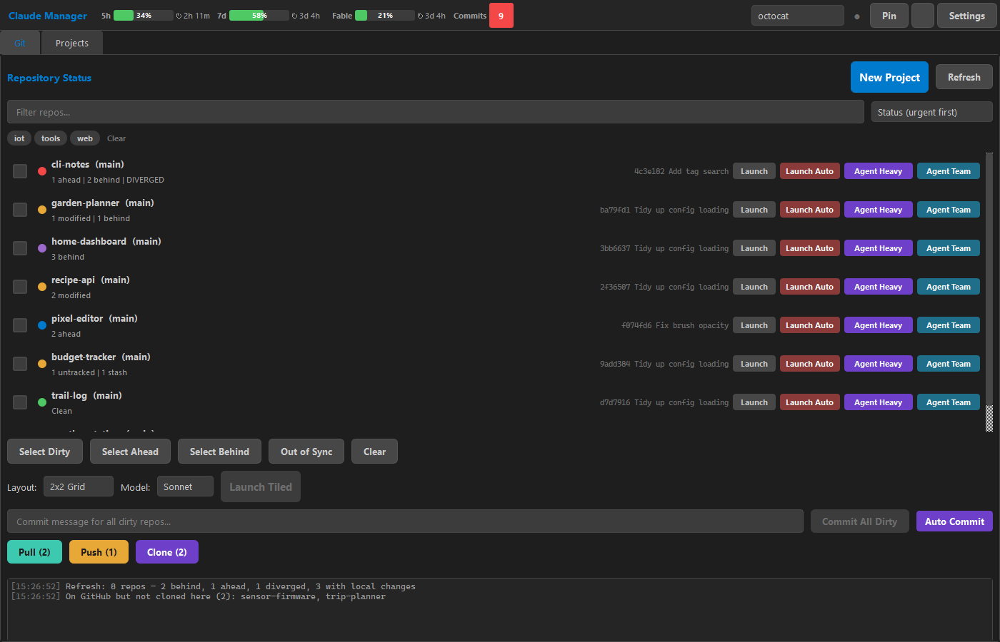

# Claude Manager

A Windows desktop app for working across many git repos with
[Claude Code](https://docs.anthropic.com/en/docs/claude-code). One window shows the git
state of every repo you have, syncs them safely, and opens Claude Code in any of them
(one at a time or several tiled side by side).

Built with Python and PySide6. Windows 10/11 only.



<sub>Shown with demo repos.</sub>

---

## Contents

- [Why](#why)
- [Features](#features)
- [Safety model](#safety-model)
- [Requirements](#requirements)
- [Getting started](#getting-started)
- [Using it](#using-it)
- [Keyboard shortcuts](#keyboard-shortcuts)
- [Configuration](#configuration)
- [Building the installer](#building-the-installer)
- [Development](#development)
- [Known limitations](#known-limitations)
- [License](#license)

---

## Why

With dozens of repos across a couple of GitHub accounts and several Claude Code sessions
running at once, routine questions get tedious to answer by hand:

- Which repos have uncommitted work?
- Which are behind GitHub, ahead of it, or diverged?
- Did I forget to clone something?

Opening a session in a repo that is behind its remote also invites merge pain later.

Claude Manager answers those questions at a glance. It makes the safe actions (fetch,
fast-forward, push what's strictly ahead) one click, and every Claude launch checks the
remote first.

## Features

### Git tab: status of every repo

- **Status card per repo:** branch, modified/untracked counts, ahead/behind, diverged,
  stash count, last commit, and a colored status dot.
- **One read-only Refresh** (`Ctrl+R`) rescans every repo, fetches remotes so
  ahead/behind is current, and checks GitHub for repos you haven't cloned. It changes
  nothing.
- **Pull / Push / Clone buttons show their counts**, e.g. `Pull (3)`, `Push (1)`,
  `Clone (2)`. The counts follow your selection: with repos ticked, they cover only those
  repos; with none ticked, they cover everything.
- **Quick select and filter:** Select Dirty / Ahead / Behind, Out of Sync (ahead, behind,
  diverged or dirty), a text filter, and tag pills.
- **Sorting:** by name, by most recent activity (last commit or uncommitted change,
  whichever is newer), or by urgency
  (`error → diverged → behind+modified → behind → modified → ahead → untracked → clean`).
- **Batch commit:** one message for all dirty repos, with a `git diff --stat` preview to
  confirm first.

### Launching Claude Code

Every repo card has four launch buttons. Each opens Windows Terminal scoped to that repo.

| Button | What it starts |
|---|---|
| **Launch** | A normal interactive Claude Code session. |
| **Launch Auto** | The same, with `--dangerously-skip-permissions` (no confirmation prompts). |
| **Agent Heavy** | An auto session that delegates through an enforced Haiku → Sonnet → Opus → Fable subagent ladder. |
| **Agent Team** | An auto session acting as an Agent Teams lead (experimental): parallel Claude sessions coordinating through a shared task list. |

There are also bulk actions:

- **Launch Tiled** (`Ctrl+L`) opens Claude in every ticked repo and arranges the windows
  in a 2×2 grid or a vertical, horizontal or single layout. The model can be Default,
  Haiku, Sonnet, Opus or Fable. The layout and model are remembered.
- **Auto Commit** starts one Sonnet session per dirty repo to review the changes and write
  the commits.
- **New Project** creates a blank repo and opens Claude there to interview you (goal,
  users, first-version scope, stack, constraints). Claude then names the project, writes
  `README.md` and `PLAN.md`, scaffolds it, commits, and can optionally create the GitHub
  repo.

### Projects tab: what each repo is

- An auto-derived one-line description for every repo, taken from `PROJECT.md` /
  `README.md`, `package.json` / `pyproject.toml`, or `CLAUDE.md`.
- **Overview:** the project's README rendered as markdown. Images and raw HTML are
  stripped so it renders cleanly offline.
- **What's Next:** a picker over the repo's `PLAN` / `NEXT` / `ROADMAP` / `TODO` docs,
  newest first.
- **History:** recent commits.
- **Generate Plan:** opens Claude in plan mode to write or refresh the plan doc.

### Toolbar

- **Live usage meters** for Claude's 5-hour and 7-day limit windows (plus Fable's own
  limit), each with a reset countdown. They're read from the same endpoint that Claude
  Code's `/usage` uses.
- **Daily commit counter** with a goal, read from your GitHub contribution graph.
- **Account switcher** for multiple GitHub accounts (via `gh auth switch`). Each account
  has its own repos folder, plus a `· shared` workspace for repos other people have
  shared with you.
- **Pin** keeps the window always on top. `?` lists the keyboard shortcuts.

## Safety model

The git actions are built so a misclick can't lose work:

- **Refresh never changes anything.** It only scans and fetches.
- **Pull is always `--ff-only`.** It never creates merge commits. Diverged repos are
  skipped, not merged.
- **Push is never forced.** Repos that are both ahead and behind (diverged) are skipped,
  so you pull or resolve those first.
- **Commit shows a diff preview** before anything is committed.
- **Every launch checks the remote first.** Before opening Claude, the app fetches. If
  the repo is behind or diverged, you choose **Launch Anyway** or **Cancel**. When it's
  only behind, you also get **Pull & Launch**, which fast-forwards first. If the network is down, a quick connection probe fails fast instead of
  hanging.
- **Only one instance runs at a time.** Starting the app again focuses the window that's
  already open.

> **Heads-up:** Launch Auto, Agent Heavy, Agent Team and Auto Commit run Claude Code with
> `--dangerously-skip-permissions`, so Claude edits files and runs commands without asking.
> Use them on repos where that is acceptable.

## Requirements

| Tool | Why |
|---|---|
| Windows 10 or 11 | Uses Win32 APIs for window tiling and the single-instance lock |
| [Git](https://git-scm.com/) on `PATH` | All repo operations |
| [Windows Terminal](https://aka.ms/terminal) (`wt.exe`) on `PATH` | Hosts each Claude session |
| [Claude Code](https://docs.anthropic.com/en/docs/claude-code) (`claude`) on `PATH`, signed in | The sessions themselves, and the usage meters |
| [GitHub CLI](https://cli.github.com/) (`gh`), signed in | Account switching, Clone, the commit counter, New Project's repo creation |
| Python 3.10+ and [uv](https://docs.astral.sh/uv/) | Only for running from source or building |

The app checks for `git`, `wt.exe` and `claude` at startup and tells you if any are
missing.

## Getting started

### Run from source

```bash
git clone https://github.com/user577/claude-manager.git
cd claude-manager
uv sync
uv run python main.py
```

### Or install

Build the installer (see [below](#building-the-installer)) and run
`Output/ClaudeManager-Setup-1.0.0.exe`. It installs per user to
`%LOCALAPPDATA%\Programs\ClaudeManager\`, needs no admin rights, and adds a Start Menu
shortcut (desktop shortcut optional).

### First run

1. The app picks up every account signed in to `gh` and creates two workspaces for each:
   your own repos, and a `· shared` view for repos shared with you.
2. Open **Settings** and set each account's folder. The default is
   `Documents\GitHub` in your user folder; a shared workspace defaults to a `shared`
   subfolder of its owner's folder.
3. Click **Auto-Discover** to register every git repo in the folder, or **Add Folder...**
   to add repos one at a time. Optionally give repos comma-separated tags for filtering.
4. Press **Refresh**. The cards fill in, and **Clone (n)** lights up if GitHub has repos
   you haven't cloned yet.

A workspace only ever shows repos inside its own folder, which keeps personal and work
repos from mixing when you switch accounts.

## Using it

**A typical morning:**

1. **Refresh** (`Ctrl+R`). Sort by *Status (urgent first)* to see what needs attention.
2. **Pull (n)** fast-forwards everything that's behind. **Clone (n)** brings down
   anything new.
3. Tick the repos you're working in today, pick a layout and model, and press
   **Launch Tiled** (`Ctrl+L`).

**At the end of the day:**

1. Click **Select Dirty**, type a message, and choose **Commit All Dirty**
   (`Ctrl+Enter`). Or let **Auto Commit** write the messages for you.
2. **Push (n)** sends everything that's strictly ahead.

**Starting something new:** click **New Project** and answer Claude's questions. Once the
interview window closes, the folder takes its chosen name on the next Refresh.

## Keyboard shortcuts

| Shortcut | Action |
|---|---|
| `Ctrl+R` | Refresh (rescan, fetch, check GitHub) |
| `Ctrl+L` | Launch ticked repos tiled |
| `Ctrl+Enter` | Commit all dirty repos |
| `Ctrl+1` | Git tab |
| `Ctrl+2` | Projects tab |

## Configuration

Everything lives in `%LOCALAPPDATA%\ClaudeManager\`:

| File | Contents |
|---|---|
| `settings.json` | Accounts and their folders, repos and tags, layout, model, sort, window geometry, daily commit goal |
| `claude_manager.log` | Rolling log (1 MB, 2 backups) |

Edit settings through the **Settings** dialog. The JSON is rewritten on save.

**The commit counter needs the `read:user` scope.** Without it, GitHub returns only your
*public* contributions, so an account with all-private repos would read `0` every day. In
that case the meter shows an amber `!`. To fix it, run:

```bash
gh auth refresh -h github.com -s read:user
```

## Building the installer

Requires [Inno Setup 6](https://jrsoftware.org/isinfo.php).

```bash
uv python install 3.12                        # once: a uv-managed Python, see below
uv sync --python 3.12 --python-preference only-managed
uv run python build_installer.py              # PyInstaller bundle + installer
uv run python build_installer.py --skip-inno  # bundle only
```

Output: `Output/ClaudeManager-Setup-1.0.0.exe`.

**Use a uv-managed Python.** The build checks that the OpenSSL DLLs come from the Python
that's doing the build. Shipping someone else's copy (for example Git's) produces an app
that starts fine but can't make HTTPS calls, so the usage meters sit at "Offline". A plain
`uv sync` can pick up a system Python, and the check then stops the build on purpose.
`uv python install` alone isn't enough: `uv sync` keeps reusing an existing `.venv` built
on a system Python, so keep the `--python-preference only-managed` flag.

## Development

```bash
uv sync
uv run pytest        # 157 tests
uv run python main.py
```

```
main.py                 entry point
src/app.py              startup, single-instance lock, prerequisite check
src/config/settings.py  settings, accounts, folder scoping, repo discovery
src/core/               git scanning and operations, launching, tiling, usage, commit counter
src/gui/                main window, Git and Projects tabs, dialogs, widgets
tests/                  pytest suite (no network; real git where it matters)
```

[`PROJECT.md`](PROJECT.md) is the detailed internals reference: what each module does,
and why the less obvious decisions were made (`wt.exe` argument escaping, clearing
inherited Claude session variables, folder pruning rules).

## Known limitations

- **Windows only.** Window tiling, the single-instance lock and the Windows Terminal
  launch path are all Win32-specific.
- **Agent Team is experimental.** It depends on Claude Code's Agent Teams feature.
- **No local-model front end.** An Ollama backend exists in
  `src/core/process_launcher.py`, but no UI uses it and its launch path has a known defect
  (documented in the file). [`docs/ollama-setup-guide.html`](docs/ollama-setup-guide.html)
  covers the setup side.
- **Tiling uses the primary monitor only.**

## License

[MIT](LICENSE)
